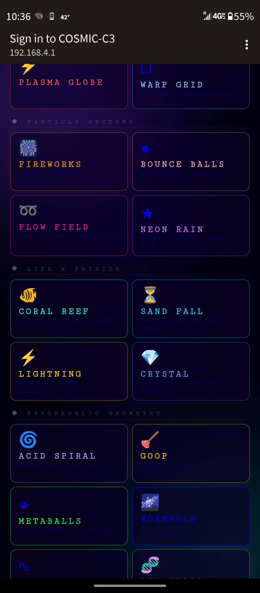
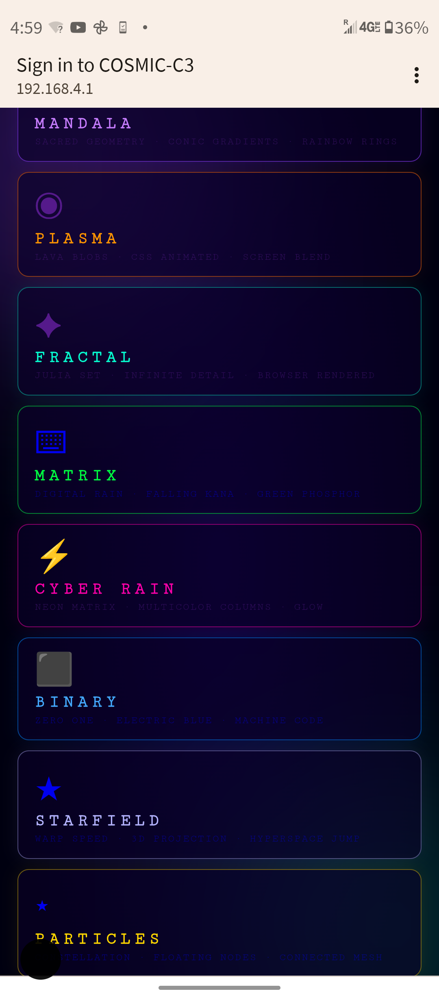
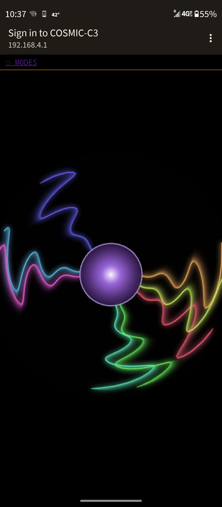
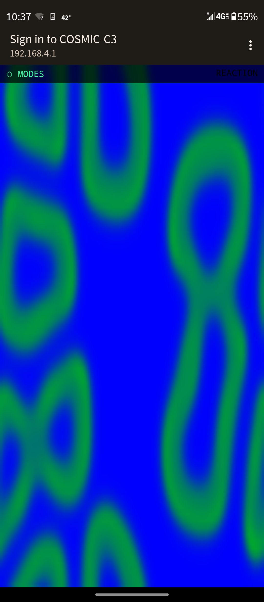
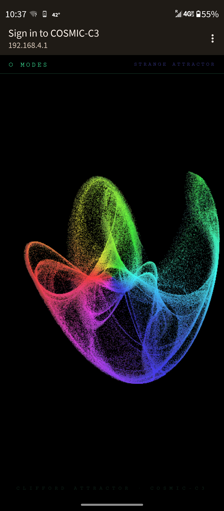

# COSMIC-C3 FREE ART PORTAL 🎨

A generative art captive portal running on the **ESP32-C3 Super Mini**. Connect to the WiFi access point and your phone auto-launches a full-screen interactive art gallery — no internet required, no app, no login. Just join the network and the art comes to you.

60+ modes spanning mathematical attractors, generative fractals, physics simulations, ambient animations, and playable games — all rendered entirely in the mobile browser. The C3 just serves static HTML.

---

## Screenshots

| | |
|---|---|
|  |  |
| *Strange Attractor — rainbow Clifford attractor plotted live* | *Mode selector — the portal landing page* |
|  |  |
| *Matrix Rain — triggered automatically by captive portal on Android* | *Tetris — fully playable with touch d-pad* |
|  |  |
| *Conway's Game of Life — random seed, live simulation* | *Kaleidoscope — mirrored canvas art* |

---

## Hardware

| Part | Detail |
|---|---|
| Board | ESP32-C3 Super Mini |
| Framework | Arduino (via PlatformIO) |
| LED | GPIO 8, active LOW (onboard) |
| WiFi | AP mode — 2.4 GHz, no password |
| IP | `192.168.4.1` |
| SSID | `COSMIC-C3 FREE ART PORTAL 🎨` |

---

## Modes

Navigate to `192.168.4.1` to reach the mode selector. All visuals run locally in the browser — the C3 serves static HTML only.

### 🌀 Generative / Visual

| Route | Name | Description |
|---|---|---|
| `/mandala` | **Mandala** | Sacred geometry with CSS conic gradients and rainbow rings |
| `/plasma` | **Plasma** | Animated lava blobs using CSS radial gradients and `mix-blend-mode: screen` |
| `/fractal` | **Fractal** | Julia Set rendered chunk-by-chunk on canvas (c = −0.7269 + 0.1889i) |
| `/tunnel` | **Tunnel** | 20 concentric rotating squares with hue cycling — infinite psychedelic vortex |
| `/kaleidoscope` | **Kaleidoscope** | Mirrored canvas with rotating color segments |
| `/lava2` | **Lava Lamp** | Slow organic blob simulation |
| `/acidspiral` | **Acid Spiral** | Rotating spiral with hue-cycling neon colors |
| `/plasmaglobe` | **Plasma Globe** | Electric tendrils radiating from center |
| `/warpgrid` | **Warp Grid** | Perspective grid bending through hyperspace |
| `/noise` | **Noise Field** | Animated Perlin noise color field |
| `/mirrorblob` | **Mirror Blob** | Symmetrically mirrored morphing blob |
| `/retrogeo` | **Retro Geo** | Geometric shapes with retro color palette |

### 🌧 Rain / Matrix Variants

| Route | Name | Description |
|---|---|---|
| `/matrix` | **Matrix** | Classic green digital rain — ASCII + half-width katakana |
| `/cyber` | **Cyber Rain** | Same engine, each column gets a random neon color with canvas glow |
| `/binary` | **Binary** | Only `0` and `1`, electric blue — raw machine code feel |
| `/mfire` | **Fire Matrix** | Digital rain in ember orange and red |
| `/mice` | **Ice Matrix** | Cold cyan and white rain |
| `/mstorm` | **Storm Matrix** | Electric grey and white |
| `/mblood` | **Blood Matrix** | Deep crimson rain |
| `/mgold` | **Gold Matrix** | Warm amber and yellow |
| `/mvoid` | **Void Matrix** | Near-invisible ultra-dark purple |
| `/mphantom` | **Phantom Matrix** | Ghostly white with fade |
| `/mripple` | **Ripple Matrix** | Rain with wave distortion |
| `/mglitch` | **Glitch Matrix** | Corrupted scan-line aesthetic |
| `/neonrain` | **Neon Rain** | Multi-color neon streaks |

### 📐 Mathematical Attractors & Fractals

| Route | Name | Description |
|---|---|---|
| `/strange` | **Strange Attractor** | Rainbow Clifford/Peter de Jong attractor plotted particle by particle |
| `/hopalong` | **Hopalong** | Martin's Hopalong attractor — chaotic orbit plotting |
| `/lorenz` | **Lorenz** | Lorenz butterfly attractor in 3D projection |
| `/lissajous` | **Lissajous** | Parametric Lissajous curves with phase drift |
| `/sierpinski` | **Sierpinski** | Sierpinski triangle via chaos game |
| `/spirograph` | **Spirograph** | Hypotrochoid / epitrochoid curves |
| `/barnsley` | **Barnsley Fern** | IFS fractal fern — iterated function system |
| `/dragon` | **Dragon Curve** | Heighway dragon fractal iteration |
| `/apollonian` | **Apollonian Gasket** | Recursive circle packing fractal |
| `/quasicrystal` | **Quasicrystal** | Aperiodic tiling interference pattern |
| `/interference` | **Interference** | Wave interference and Moiré patterns |
| `/voronoi` | **Voronoi** | Animated Voronoi diagram with moving seeds |
| `/reaction` | **Reaction Diffusion** | Gray-Scott reaction-diffusion simulation |

### ✨ Space / Cosmic

| Route | Name | Description |
|---|---|---|
| `/starfield` | **Starfield** | 200 stars projected in 3D — warp jump streaks |
| `/aurora` | **Aurora** | Northern lights — layered sine wave curtains |
| `/nebula` | **Nebula** | Deep space gas cloud with particle glow |
| `/deepstars` | **Deep Stars** | Dense starfield with parallax depth layers |
| `/wormhole` | **Wormhole** | Spiraling tunnel into a black hole |
| `/fireworks` | **Fireworks** | Physics-based firework bursts with trails |

### 🌿 Nature / Ambient

| Route | Name | Description |
|---|---|---|
| `/campfire` | **Campfire** | Flickering fire particle simulation |
| `/raindrops` | **Raindrops** | Rippling raindrops on water surface |
| `/coral` | **Coral** | DLA-style branching coral growth |
| `/snowflakes` | **Snowflakes** | Drifting snowflakes with rotation |
| `/vines` | **Vines** | Organic vine growth across the screen |
| `/flowfield` | **Flow Field** | Particles following a Perlin noise vector field |

### 🔷 3D / Geometric

| Route | Name | Description |
|---|---|---|
| `/cube3d` | **3D Cube** | Wireframe rotating cube with depth |
| `/torus` | **Torus** | Rotating 3D torus with color mapping |
| `/hypercube` | **Hypercube** | 4D tesseract projected to 2D, rotating |
| `/sunflower` | **Sunflower** | Fibonacci spiral phyllotaxis pattern |
| `/crystal` | **Crystal** | Geometric crystal lattice with shimmer |
| `/cwaves` | **Color Waves** | Rippling interference color waves |

### ⚡ Physics / Interactive

| Route | Name | Description |
|---|---|---|
| `/metaballs` | **Metaballs** | Organic blobs merging with isosurface rendering |
| `/goop` | **Goop** | Viscous fluid-like blob physics |
| `/lightning` | **Lightning** | Branching lightning bolt simulation |
| `/bounceballs` | **Bounce Balls** | Elastic collision ball physics |
| `/dna` | **DNA** | Rotating double helix with base pairs |
| `/sandfall` | **Sand Fall** | Falling sand cellular automaton |
| `/particles` | **Particles** | 70 floating nodes connecting when close — constellation mesh |
| `/cityflow` | **City Flow** | Top-down city traffic flow simulation |

### 🎮 Games

| Route | Name | Description |
|---|---|---|
| `/tetris` | **Tetris** | Full Tetris with ghost piece, levels, touch d-pad, and hard drop |
| `/snake` | **Snake** | Classic Snake with touch controls |
| `/breakout` | **Breakout** | Brick-breaking arcade game |
| `/gameoflife` | **Game of Life** | Conway's Game of Life with random seed and live controls |
| `/maze` | **Maze** | Real-time maze generation via recursive backtracking |

---

## LED Behavior

The onboard LED on GPIO 8 gives live status at a glance:

| State | Pattern |
|---|---|
| Idle — no clients connected | Slow heartbeat: 200ms on / 1.8s off |
| Active — device on the AP | Rapid strobe: 80ms on / 80ms off |

---

## Build & Flash

Requires [PlatformIO](https://platformio.org/).

```bash
# Build
pio run

# Flash
pio run --target upload

# Monitor serial (optional)
pio device monitor
```

Board config (`platformio.ini`):
```ini
[env:esp32-c3-devkitm-1]
platform = espressif32
board = esp32-c3-devkitm-1
framework = arduino
monitor_speed = 115200
build_flags =
    -DCORE_DEBUG_LEVEL=0
```

---

## How It Works

1. The C3 boots into WiFi AP mode broadcasting `COSMIC-C3 FREE ART PORTAL 🎨`
2. A DNS server catches **all** DNS queries and redirects them to `192.168.4.1`
3. When a device joins the network, the OS detects no internet and auto-launches the captive portal browser — no user action needed
4. The WebServer serves self-contained HTML pages; all visuals are CSS/canvas/JS running locally in the browser
5. The LED switches to rapid blink the moment `WiFi.softAPgetStationNum() > 0`

Everything is a single `main.cpp` — no SPIFFS, no external libraries beyond the standard ESP32 Arduino stack.

