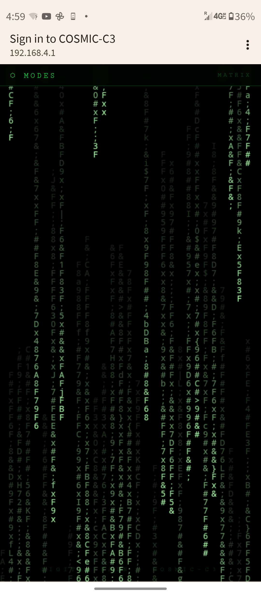

# COSMIC-C3

A psychedelic WiFi captive portal running on the **ESP32-C3 Super Mini**. Connect to the access point and your phone auto-launches a full-screen visual experience — no internet required, no app, no interaction needed beyond joining the network.


*Matrix Rain mode — triggered automatically by the captive portal on Android*

---

## Hardware

| Part | Detail |
|---|---|
| Board | ESP32-C3 Super Mini |
| Framework | Arduino (via PlatformIO) |
| LED | GPIO 8, active LOW (onboard) |
| WiFi | AP mode — 2.4 GHz, no password |
| IP | `192.168.4.1` |
| SSID | `COSMIC-C3` |

---

## Modes

Navigate to `192.168.4.1` to reach the mode selector. 9 modes total, all rendered entirely in the browser — the C3 just serves static HTML.

| Route | Name | Description |
|---|---|---|
| `/mandala` | **Mandala** | Sacred geometry with CSS conic gradients and rainbow rings |
| `/plasma` | **Plasma** | Animated lava blobs using CSS radial gradients and `mix-blend-mode: screen` |
| `/fractal` | **Fractal** | Julia Set rendered chunk-by-chunk on canvas (c = −0.7269 + 0.1889i) |
| `/matrix` | **Matrix** | Classic green digital rain — ASCII + half-width katakana falling per column |
| `/cyber` | **Cyber Rain** | Same rain engine but each column gets a random neon color with canvas glow |
| `/binary` | **Binary** | Only `0` and `1`, bolder font, electric blue — raw machine code feel |
| `/starfield` | **Starfield** | 200 stars projected in 3D from center outward as streaking lines — warp jump |
| `/particles` | **Particles** | 70 floating nodes that connect with lines when they drift close — constellation mesh |
| `/tunnel` | **Tunnel** | 20 concentric rotating squares with hue cycling — infinite psychedelic vortex |

---

## LED Behavior

The onboard LED on GPIO 8 gives live status at a glance:

| State | Pattern |
|---|---|
| Idle — no clients connected | Slow heartbeat: 200ms on / 1.8s off |
| Active — device on the AP | Rapid strobe: 80ms on / 80ms off |

---

## Build & Flash

Requires [PlatformIO](https://platformio.org/).

```bash
# Build
pio run

# Flash
pio run --target upload

# Monitor serial (optional)
pio device monitor
```

Board config (`platformio.ini`):
```ini
[env:esp32-c3-devkitm-1]
platform = espressif32
board = esp32-c3-devkitm-1
framework = arduino
monitor_speed = 115200
```

---

## How It Works

1. The C3 boots into WiFi AP mode broadcasting `COSMIC-C3`
2. A DNS server catches all DNS queries and redirects them to `192.168.4.1`
3. When a device joins the network, the OS detects no internet and auto-launches the captive portal browser — no user action needed
4. The WebServer serves self-contained HTML pages; all visuals are CSS/canvas/JS running locally in the browser
5. The LED switches to rapid blink the moment `WiFi.softAPgetStationNum() > 0`

Everything is a single `main.cpp` — no SPIFFS, no external libraries beyond the standard ESP32 Arduino stack.
